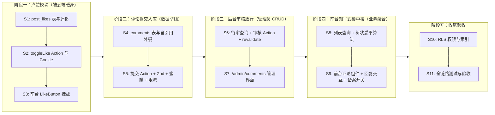

# 评论与点赞体系 Spec v1.2

> 状态：Ready v1.2（知乎式楼中楼与备案开关已就绪，可进入实施）  
> 日期：2026-10-09（v1.2 修订）；2026-10-08（v1.1 修订）；2026-10-07（v1.0 草案）  
> 关联文档：`specs/spec-jiangruijians-blog.md`、`specs/spec-tag-management.md`  
> 目标：文章获得评论与点赞能力。**自建表实现，不使用 Giscus**（决策：不依赖 GitHub Discussions，数据自主可控）。

**v1.2 修订摘要（相对 v1.1，2026-10-09）：**

- **知乎社区式楼中楼回复模型（Zhihu-style Replies）**：
  - **展示层级**：统一为视觉二级扁平化排版（顶级根评论 + 楼中回复流「N 条回复」），彻底避免多级套娃深层缩进对移动端阅读的破坏；
  - **指向标识（`XXX ▶ YYY`）**：直接回复根评论显示 `XXX`；回复楼中某条子回复显示 `XXX ▶ YYY`（小三角或 ChevronRight 区分）；正文保持纯净，不再手动拼接 `@昵称` 前缀；
  - **数据建模**：`parent_id` 始终指向楼层顶级根评论（保证同楼回复一次性聚合），新增 `reply_to_id`（自引用 FK，指向被回复的具体发言，`onDelete: set null`）；
  - **交互契约**：根评论与子回复均提供「回复」按钮；点击后输入框激活并提示「正在回复 @YYY」，点击取消可重置为顶级评论输入；
  - **博主徽章**：若评论者为博主（登录态匹配管理员或后台配置），昵称旁自动挂上 `[博主]` 专属小徽章。
- **国内备案合规与全局评论开关（Feature Flag）**：
  - 增加配置开关 `NEXT_PUBLIC_ENABLE_COMMENTS`（默认 `true`）；
  - 当未来提交国内个人 ICP 备案时，置为 `false` 即可彻底隐藏前台文章页评论表单与列表，满足个人性质备案禁止交互论坛的监管要求；备案通过后一键开启，进退自如。

**已确认决策（需求方）：**

| 决策项 | 结论 |
| --- | --- |
| 评论身份 | **匿名昵称制**——昵称必填，主页链接选填；不做强制登录、无第三方 OAuth 依赖 |
| 发布策略 | **先审后显**——新评论进 `pending` 队列，后台放行后前台可见（国内合规底线 + 防黑帽 SEO 垃圾外链） |
| 回复层级 | **知乎式楼中楼**——视觉严格二级，回复子评论显示 `XXX ▶ YYY`，输入正文无需手动带 `@` |
| 点赞行为 | **可撤销 toggle**——心形按钮再点一次取消；访客身份为持久 cookie 随机 UUID，不采集 IP/指纹；首次交互时写入 |
| 反垃圾 | 蜜罐字段（带 a11y 保护）+ IP 哈希限流（10 分钟 3 条）+ 外链 nofollow/ugc + 后台人工删除 |
| 备案兼容 | 预留 `NEXT_PUBLIC_ENABLE_COMMENTS` 开关，备案审核期一键隐藏，备案通过后开启 |
| 通知 | v1 不做邮件通知（无 SMTP 基础设施） |

---

## 1. 摘要

新增 `comments` 与 `post_likes` 两表。评论走「提交 → 待审 → 后台放行 → 前台展示」链路，采用知乎式两级楼中楼（根评论 + 楼内回复流，支持 `XXX ▶ YYY` 对话指向）；点赞为匿名访客可撤销的 toggle。写入全部经 Server Action（owner 绕过 RLS + 应用层校验，与现有写路径同口径），两表 RLS 开启但不建公开策略。预留全局开关保障国内 ICP 备案弹性。

## 2. 目标与非目标

### 2.1 目标

- 访客在文章页提交评论（昵称 / 主页选填 / 内容），先审后显；
- 知乎式楼中楼回复：根评论下聚合回复流，支持回复楼内任意发言并显示 `XXX ▶ YYY`；
- 后台评论管理：待审队列、放行、删除（含级联删除其回复）、状态筛选、回复上下文识别；
- 文章页点赞按钮：匿名可赞可取消，实时计数，防重防连击冲突；
- 安全与合规保障：蜜罐字段、IP 哈希限流（10 分钟 3 条）、外链 nofollow/ugc 防刷、纯文本防注入、个人备案全局开关联动。

### 2.2 非目标（v1 明确不做）

- 评论邮件通知（无 SMTP/Resend 基础设施，后续独立变更）；
- 树状深层视觉缩进（严格限制为两级平铺，移动端友好）；
- 评论编辑、评论点赞（只给文章点赞）；
- 评论内容 Markdown 渲染（纯文本 + 换行展示，防注入面最小化）；
- GitHub 登录评论 / 强制三方认证；
- 敏感词自动过滤（人工审核兜底）；
- 附件/图片评论。

## 3. 数据库设计（Drizzle schema，迁移 0003）

### 3.1 `comments`

| 字段 | 类型 | 约束/默认值 | 说明 |
| --- | --- | --- | --- |
| `id` | `uuid` | PK, `gen_random_uuid()` | |
| `post_id` | `uuid` | FK `posts.id` ON DELETE CASCADE | |
| `parent_id` | `uuid` | NULL，自引用 FK ON DELETE CASCADE | 楼层**顶级根评论** ID；NULL 代表自身为顶级根评论 |
| `reply_to_id` | `uuid` | NULL，自引用 FK ON DELETE SET NULL | 具体**回复的目标发言** ID；NULL 代表直接回复根评论 |
| `author_name` | `text` | NOT NULL | 1–30 字（trim 后） |
| `author_url` | `text` | NULL | 选填主页，必须为 http(s) 绝对地址，≤200 |
| `content` | `text` | NOT NULL | 1–1000 字（trim 后，纯文本） |
| `status` | `text` | NOT NULL, `'pending'` | `'pending'` / `'approved'` |
| `ip_hash` | `text` | NOT NULL | HMAC-SHA256(IP+UA, AUTH_SECRET)，**不存原始 IP**；仅用于限流与封禁排查 |
| `created_at` | `timestamptz` | NOT NULL, now() | 提交时间 |
| `updated_at` | `timestamptz` | NOT NULL, now() | 审核状态变更或记录更新时间 |

**Drizzle 实现注意事项**：
- 自引用外键在 Drizzle 中若在列声明内写 `.references(() => comments.id)` 会因 TS 循环引用报错；须在 `pgTable` 尾部 callback 声明：
  ```ts
  (table) => [
    foreignKey({
      columns: [table.parentId],
      foreignColumns: [table.id],
    }).onDelete("cascade"),
    foreignKey({
      columns: [table.replyToId],
      foreignColumns: [table.id],
    }).onDelete("set null"),
    index("comments_post_created_idx").on(table.postId, table.createdAt),
    index("comments_parent_created_idx").on(table.parentId, table.createdAt),
    index("comments_ip_hash_idx").on(table.ipHash, table.createdAt),
    index("comments_status_idx").on(table.status, table.createdAt),
  ]
  ```

### 3.2 `post_likes`

| 字段 | 类型 | 约束/默认值 | 说明 |
| --- | --- | --- | --- |
| `post_id` | `uuid` | FK `posts.id` ON DELETE CASCADE | |
| `visitor_id` | `uuid` | NOT NULL | 访客浏览器持久 cookie 的随机 UUID（由 Server Action 首次写入，httpOnly，1 年） |
| `created_at` | `timestamptz` | NOT NULL, now() | |

主键 `(post_id, visitor_id)` 天然防重；点赞计数 = `count(*)`（博客量级由主键首列索引覆盖，无需反范式列）。

### 3.3 数据不变量

| # | 不变量 | 强制层级 |
| --- | --- | --- |
| 1 | `status` 仅取 `pending` / `approved` | 应用层（zod + TS 联合类型） |
| 2 | 前台只展示 `status = 'approved'` | 应用层（查询过滤） |
| 3 | `parent_id` 必须指向同文章、`approved`、且自身为顶级的评论（或为 NULL） | 应用层（action 校验） |
| 4 | `reply_to_id` 若存在，必须指向同文章且属于同 `parent_id` 的已通过评论 | 应用层（action 校验） |
| 5 | `(post_id, visitor_id)` 唯一 | DB（联合主键） |
| 6 | 不存原始 IP，仅存 HMAC 哈希 | 应用层 |
| 7 | 文章删除级联删除其评论与点赞 | DB（FK CASCADE） |
| 8 | 删除顶级评论级联删除整楼回复 | DB（parent_id 自引用 CASCADE） |
| 9 | 删除某条子回复不删除回复它的后续发言 | DB（reply_to_id 自引用 SET NULL） |

迁移 0003 为纯建表（additive），先执行或先部署均无顺序风险。

## 4. 写入与限流（Server Action）

落点：`src/app/(blog)/posts/[slug]/actions.ts` 追加。

### 4.1 `addCommentAction(prev, formData)`（useActionState 签名）

1. **zod 校验**（`src/lib/validators/comment.ts`）：
   - `postId`：uuid；
   - `authorName`：1–30 字（trim 后）；
   - `authorUrl`：选填，若填写必须严格匹配 `/^https?:\/\//i` 且长度 ≤200（拒绝 `javascript:` 等非法协议）；
   - `content`：1–1000 字（trim 后）；
   - `parentId`：uuid 可空（楼层顶级根评论）；
   - `replyToId`：uuid 可空（具体回复的目标发言）；
   - **`website` 蜜罐字段**：必须为空。
2. **蜜罐**：隐藏字段 `website` 非空（机器人填写）→ 静默返回成功文案，不写库；
3. **限流**：
   - Next.js 16 下 `const h = await headers()`；
   - IP 提取：优先读取 `cf-connecting-ip` / `x-real-ip`，其次 `x-forwarded-for` 首段（按 `,` 拆分并 trim），兜底为 `"0.0.0.0"`；
   - UA 提取：`h.get("user-agent") ?? "unknown"`；
   - 哈希：`ipHash = HMAC-SHA256(ip + "|" + ua, AUTH_SECRET)`（`node:crypto` 的 `createHmac`）；
   - 查询该 hash 在过去 10 分钟窗口内的评论数，≥3 → 拒绝并提示「评论太频繁，请稍后再试」；
4. **回复从属关系校验**：
   - 若提供了 `parentId`：目标评论必须存在、同文章、已通过、且自身 `parentId IS NULL`（顶级根评论）；
   - 若提供了 `replyToId`：目标评论必须存在、同文章、已通过，且其所属根评论必须与 `parentId` 一致（若目标就是根评论，则 `replyToId` 归一化为 NULL）；
5. **写入**：插入 `status: 'pending'`；返回成功文案「**评论已提交，博主审核通过后显示**」（先审后显，前台列表暂不刷新）。

### 4.2 `toggleLikeAction(postId)` 

1. **Cookie 读取与懒写入**：
   - 读取 cookie `lk_visitor`：若无，生成随机 UUID 并写入响应（httpOnly、sameSite lax、maxAge 1 年、path `/`）；
   - 说明：**RSC 仅做读取，严禁在 RSC 阶段写入 cookie**；首次写入仅在此时由 Server Action 完成；
2. **切换与防重**：
   - 检查 `post_likes` 是否存在 `(postId, visitorId)`；
   - 若存在 → 执行删除；
   - 若不存在 → 执行插入。使用 `onConflictDoNothing` 或捕获唯一键异常（`23505`），防止用户连击引发竞态崩溃；
3. **返回**：查询最新 `count`，返回 `{ liked: boolean, count: number }`；若异常失败回滚客户端状态。

## 5. 查询（`queries.ts` 追加，均不缓存）

| 查询 | 说明 |
| --- | --- |
| `listApprovedComments(postId)` | `status='approved'` 按 `created_at` 正序；应用层构建知乎式结构 `{ root: CommentItem, replies: (CommentItem & { replyToAuthor?: string })[] }[]` |
| `getLikeState(postId, visitorId?)` | visitorId 为空时 liked 固定为 false；返回 `{ count, liked }` |
| `listAdminComments({ status?, page? })` | join posts 取文章标题/slug；left join 父评论与目标评论取作者名与摘要；`createdAt` 倒序分页（10/页） |
| `getAdminCommentKpis()` | `{ pending, approved }` 计数 |

详情页为 `force-dynamic`，评论列表与点赞状态 RSC 直查无缓存问题；点赞计数实时查询，不做反范式。

## 6. 前台（文章详情页）

### 6.1 挂载点与国内备案开关

- **全局评论开关**：详情页根据 `process.env.NEXT_PUBLIC_ENABLE_COMMENTS !== "false"` 决定是否渲染评论区块。若为 `false`，完全不输出评论区 HTML，确保国内个人备案审核平稳过审；
- `MarkdownWithToc` footer 内、`PostNavigation` **之前**挂载「评论」区块；
- header meta 行「N 次阅读」旁追加点赞计数（`❤ N`）；
- 新增 `LikeButton`（client）挂 footer 按钮组。

### 6.2 组件

**`src/components/blog/comments.tsx`**（`"use client"`）：
- **知乎式楼中楼排版**：
  - **顶级根评论**：作者头像占位/首字徽章、昵称（若为博主显示 `[博主]` 徽章）、发布时间、纯文本内容、底部「回复」按钮；
  - **楼中回复流**：若根评论下有回复，在卡片下方渲染浅色背景/边框的平铺回复区（标明「N 条回复」）；
  - **子回复头部**：
    - 若 `replyToAuthor` 为空（直接回复根评论）：渲染 `<span>{authorName}</span>`；
    - 若 `replyToAuthor` 存在：渲染：
      ```tsx
      <span className="font-medium text-foreground">{reply.authorName}</span>
      <ChevronRight className="inline size-3.5 text-muted-foreground mx-0.5" />
      <span className="font-medium text-muted-foreground">{reply.replyToAuthor}</span>
      ```
  - **内容排版**：正文使用 `<p className="whitespace-pre-wrap break-words">`，防超长字符串溢出；
  - **外链安全**：作者主页链接统一渲染为 `<a href={authorUrl} target="_blank" rel="noopener noreferrer nofollow ugc">`；
- **交互契约**：
  - 顶级评论与子回复项均有「回复」按钮；
  - 点击任何一处的「回复」时：
    - 若点击顶级根评论：表单设置 `parentId = root.id`，`replyToId = null`，提示「正在回复 @{root.authorName}」；
    - 若点击子回复：表单设置 `parentId = root.id`（同楼），`replyToId = reply.id`，提示「正在回复 @{reply.authorName}」；
    - 输入框正文保持干净空白，无需手动加 `@`；
    - 表单顶部显示回复目标提示与「取消回复」按钮（重置为发表新顶级评论）；
- **`CommentForm`**：
  - 字段：昵称（Input，必填）、主页（Input，选填）、内容（Textarea，必填）；
  - 蜜罐字段：`<input name="website" tabIndex={-1} aria-hidden="true" autoComplete="off" className="sr-only hidden" />`；
  - `useActionState` 提交；pending 态禁用按钮并显示加载中；
  - 成功态提示「评论已提交，博主审核通过后显示」，清空内容，保留昵称/主页。

**`src/components/blog/like-button.tsx`**（`"use client"`）：
- 心形图标 + 计数；props `{ postId, initialCount, initialLiked }`；
- 乐观更新（liked 取反，count 对应 ±1），调用 `toggleLikeAction`；
- 连击在 pending 期间防抖防重。

**服务端数据获取**：
- 详情页 RSC 读取 `(await cookies()).get("lk_visitor")?.value`（**仅读不写**）；
- 调用 `getLikeState(post.id, visitorId)` 注入 `initialCount` 与 `initialLiked`；
- 若评论开关开启，调用 `listApprovedComments(post.id)` 传入评论组件。

## 7. 后台审核（`/admin/comments`）

- **页面表格**：
  - 列：内容（截断 80 字，title 全文）/ 类型与上下文（顶级评论显示 `[楼层]` 徽章；回复根评论显示 `回复楼层 @某某`；回复子评论显示 `回复 @某某 (所属楼层: @根作者)`）/ 作者（昵称 + 主页安全外链）/ 所属文章 / 提交时间 / 状态徽章；
- **筛选 Tab**：待审 / 已通过 / 全部（searchParams）；KPI 卡：待审数、已通过数；
- **行操作**：
  - **通过**：pending → approved（更新 status 与 `updated_at`）；
  - **删除**：AlertDialog 确认（注明「若删除顶级评论，整楼回复将一并删除」）；
- **`admin/comments/actions.ts`**：
  - `approveCommentAction(id)`、`deleteCommentAction(id)`（均 isAdmin 鉴权）；
  - **缓存失效（Revalidation）**：
    ```ts
    revalidatePath(`/posts/${postSlug}`);
    revalidatePath("/admin/comments");
    ```
- **侧边栏**：「标签」之后加「评论」入口（`MessageSquare` 图标）。

## 8. RLS 与索引（`supabase/rls.sql` 追加）

- `alter table comments / post_likes enable row level security;`——**不建任何策略**（与 post_tags 同口径：匿名访客不直连库，写操作走 Server Action 的 owner 连接，前台读走 RSC 的 owner 连接）；
- 二级索引：`comments_post_created_idx on comments (post_id, created_at)`、`comments_parent_created_idx on comments (parent_id, created_at)`、`comments_ip_hash_idx on comments (ip_hash, created_at)`、`comments_status_idx on comments (status, created_at)`。

## 9. 测试与验收

### 9.1 行为链路（验证脚本可直接调查询层与 Action 模拟）

1. 提交评论 → `status='pending'` → 前台不可见 → 后台通过 → 前台可见；
2. 知乎式回复链路：
   - 读者 B 回复根评论 A → 展示在 A 的回复列表中，作者仅显示 `B`；
   - 读者 C 回复子回复 B → 展示在 A 的回复列表中，作者显示 `C ▶ B`；
3. 点赞 → count=1 且 liked=true → 再点 → count=0 且 liked=false → 换 visitorId 再赞 → count=1；快速连击不报错；
4. 10 分钟内同 ipHash 第 4 条 → 拒绝并友好提示；
5. 蜜罐字段非空 → 返回成功文案但数据库无新增记录；
6. 级联逻辑：删除根评论 A → 整楼子回复级联消失；删除子回复 B → 回复 B 的 C 保留（`reply_to_id` 置 NULL，优雅降级为楼内发言）；
7. 备案开关测试：`NEXT_PUBLIC_ENABLE_COMMENTS="false"` 时详情页完全不渲染评论组件。

### 9.2 工程

`pnpm typecheck` / `lint` / `test` / `build` 四件套全绿；机检断言复用；`/admin/comments` 需登录态手测。

### 9.3 手测清单（需求方）

匿名提交 → 待审 → 后台放行 → 前台可见全流程；知乎式 `XXX ▶ YYY` 回复交互；点赞/取消/刷新后状态保持；限流触发提示；暗色模式下表单与列表观感；外链新标签页打开与 nofollow 检查；备案开关启闭效果。

## 10. 实施阶段（真人渐进式教学与开发路线）

> **设计原则（需求驱动，随用随写）**：  
> 拒绝在前期孤立地堆砌工具函数、验证器与查询。每一个字段、Zod 规则、加密限流函数与缓存失效逻辑，均在**具体业务场景调用时才引出并编写**。帮助开发者建立清晰的「输入 → 业务逻辑 → 持久化 → 呈现」后端工程直觉。



### 10.1 渐进步骤清单

| # | 步骤 | 业务目标 | 学习与编写要点（随用随写） | 验证点 |
| :--- | :--- | :--- | :--- | :--- |
| **S1** | **点赞表结构** | 数据库建模 | 在 `schema.ts` 声明 `post_likes` 联合主键表；执行 `pnpm db:generate`（迁移 0003）。**学习点**：为什么联合主键 `(postId, visitorId)` 能在 DB 层面天然防重复点赞。 | 迁移 SQL 生成正确，`typecheck` 通过 |
| **S2** | **点赞 Action** | 后端业务逻辑 | 编写 `toggleLikeAction`。**学习点**：Next.js 服务端如何安全读写持久 Cookie、如何根据记录存在与否做切换、如何处理访客快速连击引发的联合主键冲突（并发幂等）。 | 单元测试/模拟调用能正确返回 `{ liked, count }` |
| **S3** | **点赞按钮挂载** | 前端与后端打通 | 编写 `LikeButton` 客户端组件并挂载到文章页。**学习点**：RSC 如何只读传递初始状态、客户端如何做乐观更新（点击瞬间数字变动，失败再回滚）。 | 文章详情页点击心形可点赞/取消，刷新后状态保持 |
| **S4** | **评论表结构** | 复杂关系建模 | 在 `schema.ts` 声明 `comments` 表。**学习点**：Drizzle 中自引用外键 `parentId`（级联删除整楼）与 `replyToId`（置空防止误删后续发言）的语法差异，为什么需要在 extra config 回调中定义。 | 迁移包含两张表的纯建表 SQL，`typecheck` 通过 |
| **S5** | **评论提交入库** | 输入校验与安全防护 | 编写 `addCommentAction`。**学习点（按需引出）**：<br>1. 处理表单输入时才写 `validators/comment.ts`（Zod 校验与外链正则）；<br>2. 遇到机器人刷帖时才引入 `website` 蜜罐逻辑；<br>3. 遇到频次滥用时才现场写 `ipHash`（HMAC-SHA256）与 10 分钟限流函数。全部通过后写入 `pending` 态。 | 提交合法数据入库 pending；蜜罐填值不入库；超过 3 次触发频控拦截 |
| **S6** | **审核 Action 与缓存** | 管理端业务逻辑 | 编写 `listAdminComments`、`approveCommentAction`、`deleteCommentAction`。**学习点**：左连接 posts 表取文章信息；审核状态流转；为什么需要在此调用 `revalidatePath` 强制清除 Next.js 路由缓存。 | 手测 Action：审核后评论 status 变为 approved，且对应文章页缓存被标记失效 |
| **S7** | **后台评论管理页** | 后台界面集成 | 搭建 `/admin/comments` 表格（展示回复上下文）、Tab 筛选、审核通过与删除弹窗，侧边栏增加「评论」入口。 | 管理后台可顺畅筛选 pending、一键放行或删除 |
| **S8** | **前台聚合查询** | 数据结构转换算法 | 编写 `listApprovedComments(postId)`。**学习点**：数据库查询出来的是一维平铺数组，如何用一个哈希 Map 在内存中高效组装成知乎式的「顶级根评论 + 楼内回复流 `XXX ▶ YYY`」结构。 | 查询层单元测试：输入平铺评论数据，输出结构清晰的楼中楼树形对象 |
| **S9** | **前台知乎式评论组件** | 前端交互与合规集成 | 编写 `comments.tsx`。**学习点**：渲染知乎式卡片、外链 `rel="nofollow ugc"` 安全属性；点击「回复」时在输入框激活「正在回复 @某某」与取消交互；挂载备案开关 `NEXT_PUBLIC_ENABLE_COMMENTS`。 | 前台清晰展现知乎式回复，点击任意发言均可精准回复并在作者行显示 `A ▶ B` |
| **S10** | **RLS 策略与索引** | 生产安全与性能收敛 | 在 `supabase/rls.sql` 追加两表 RLS（开启但不公开写入）与 4 个二级查询索引。**学习点**：Server Action 架构下的最小特权原则与多列复合索引设计。 | 执行 SQL 脚本无报错，权限自查通过 |
| **S11** | **全链路联调与验收** | 工程交付标准 | 运行 `typecheck` / `lint` / `test` / `build` 四件套；对照 §9.3 手测清单做全量验收。 | 四件套全绿，业务全通 |

## 11. 进度表

> 实施开始后在此记录（每完成一步记录完成状态与关键体会；**未经需求方明确指示不 commit/push**）。

| 步骤 | 状态 | 完成时间 | 备注 |
| :--- | :--- | :--- | :--- |
| S1 | ✅ 已完成 | 2026-10-09 | post_likes 联合主键表定义与迁移 0003 执行完毕 |
| S2 | ✅ 已完成 | 2026-10-09 | queries (getLikeState/togglePostLike) 与 toggleLikeAction 完成 |
| S3 | ✅ 已完成 | 2026-10-09 | LikeButton 客户端组件编写并挂载文章页，乐观更新手测成功 |
| S4 | ⬜ 待开始 | - | 评论表结构与自引用外键 |
| S5 | ⬜ 待开始 | - | 评论提交 Action（Zod + 蜜罐 + 限流） |
| S6 | ⬜ 待开始 | - | 审核 Action 与缓存失效 |
| S7 | ⬜ 待开始 | - | 后台 /admin/comments 界面 |
| S8 | ⬜ 待开始 | - | 知乎式楼中楼聚合算法 |
| S9 | ⬜ 待开始 | - | 前台评论组件与回复交互 |
| S10 | ⬜ 待开始 | - | RLS 策略与索引 |
| S11 | ⬜ 待开始 | - | 全链路联调与验收 |

